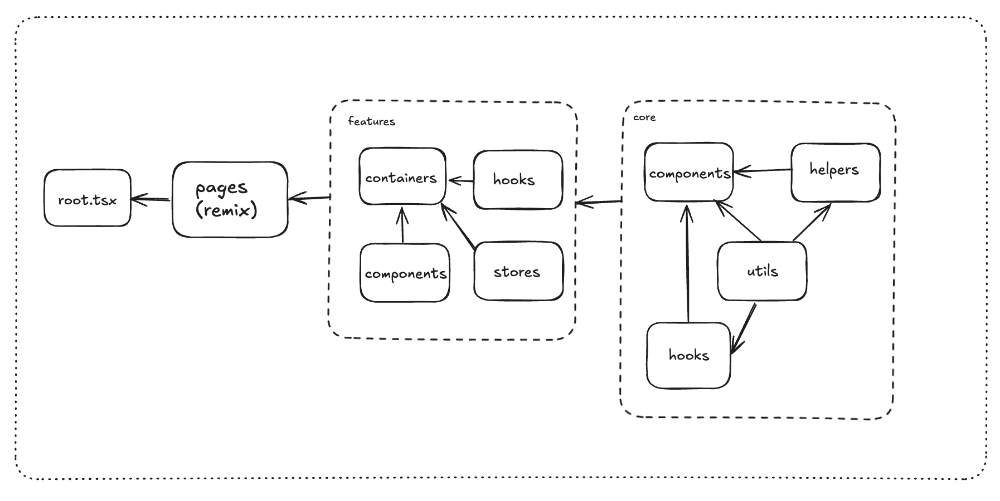

# Overview

The project follows Domain-Driven Design principles, with the following directory structure:

- features: Contains the features of the application
  - components: Contains the components of the application that localed on the features
  - containers: Contains the containers of the application that localed on the features
  - hooks: Contains the hooks of the application that localed on the features
  - stores: Contains the store of the application that localed on the features
- pages: Defines the routes of the application
- core: Contains shared utilitie, constants, components, ... and other cross-cutting concerns.
  - components: Contains the shared components of the application
  - utils: Contains the shared utilities of the application
  - helpers: Contains the shared helpers of the application

## Diagram

### Flow



## Tree

```markdown
├── docs
│ ├── guidelines
│ │ ├── folder-structure.md
│ │ ├── how-to-run-at-local.md
│ │ ├── ...
│ ├── images
│ │ ├── deconstructing-clean-archiecture.png
│ │ ├── ...
├── app
│ ├── core
│ │ ├── components
│ │ ├── utils
│ │ ├── helpers
│ ├── features
│ │ ├── home
│ │ │ │ ├── components
│ │ │ │ ├── containers
│ │ ├── tailwind-intersect
│ │ │ │ ├── components
│ │ │ │ ├── containers
│ ├── pages
│ │ ├── $.tsx
│ │ ├── index.tsx
│ │ ├── tailwind-init.tsx
│ ├── entry.client.tsx
│ ├── root.tsx
├── .gitignore
├── Dockerfile.base
├── bitbucket-pipelines.yml
├── docker-compose.yml
└── README.md
```
